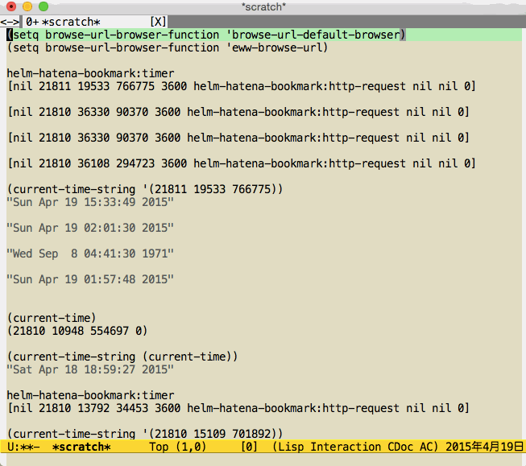

# helm-hatena-bookmark.el [![melpa badge][melpa-badge]][melpa-link] [![melpa stable badge][melpa-stable-badge]][melpa-stable-link]

## Introduction

`helm-hatena-bookmark.el` is Hatena::Bookmark helm interface.

## Screenshot



## Requirements

* Emacs 24.3 or higher
* helm 1.6.9 or higher
* curl
* GNU sed

## Installation

You can install `helm-hatena-bookmark.el` from [MELPA](https://github.com/milkypostman/melpa.git) with package.el (`M-x package-install helm-hatena-bookmark`).

## Setup

```lisp
(setq helm-hatena-bookmark:username "Your Hatena Account")
(helm-hatena-bookmark:initialize)
```

## Usage

### `helm-hatena-bookmark`

* A function to be able to select your Hatena::Bookmark.

### `helm-hatena-bookmark:source`

* A helm source for your Hatena::Bookmark.

## Acknowledgment

Thanks to k1LoW who is Author of anything-hatena-bookmark.el

https://github.com/k1LoW/anything-hatena-bookmark

[melpa-link]: http://melpa.org/#/helm-hatena-bookmark
[melpa-stable-link]: http://stable.melpa.org/#/helm-hatena-bookmark
[melpa-badge]: http://melpa.org/packages/helm-hatena-bookmark-badge.svg
[melpa-stable-badge]: http://stable.melpa.org/packages/helm-hatena-bookmark-badge.svg
